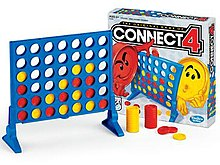

# PROJECT: Connect Four

Connect Four is a two-player connection board game, in which the players take turns dropping colored tokens into a seven-column, six-row vertically suspended grid. The pieces fall straight down, occupying the lowest available space within the column. The objective of the game is to be the first to form a horizontal, vertical, or diagonal line of four of one's own tokens. Connect Four is a solved game. The first player can always win by playing the right moves.

Give my implementation a try: https://replit.com/@1lubo/connectfour#main.rb
